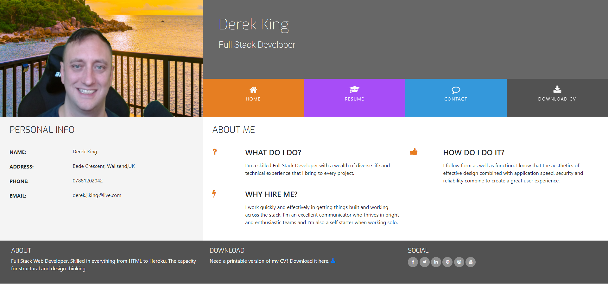

# Resume

This is a resume template created using HTML, CSS, and Bootstrap.

## Table of Contents
- [Introduction](#introduction)
- [Preview](#preview)
- [Features](#features)
- [How to Use](#how-to-use)
- [Dependencies](#dependencies)
- [Credits](#credits)
- [Deployment](#deployment)
- [Bugs and Fixes](#bugs-and-fixes)
- [License](#license)

## Introduction

This resume template is designed to showcase your skills, experience, and qualifications in a professional and visually appealing manner. With a responsive layout and modern design, this template provides an effective way to present your resume online.

## Preview

## Features

This resume template includes the following features:

- **Home**: Provides an overview of your profile, skills, and summary.
- **Contact**: Displays your contact information for recruiters and potential employers to reach out to you.
- **Download CV**: Allows users to download your resume as a document file.
- **Resume**: Presents detailed information about your work experience, education, and achievements.

## How to Use

1. Clone this repository to your local machine.
2. Open `index.html` in your preferred web browser.
3. Customize the resume content in the HTML file to match your own details and experiences.
4. Replace the profile image with your own image. Save it as `profile.jpg` and replace the existing file in the `image` directory.
5. Replace the URL file path in `style.css` under `.logo{}` with the path to your desired logo image.
6. Replace the sample document file with your own document file. Save it as `resume.doc` and replace the existing file in the root directory.

## Dependencies

This resume template is built using the following dependencies:

- Bootstrap v4.2.1
- Font Awesome v4.7.0
- Cloudflare.com (optional, for hosting and CDN services)

## Credits

This template is based on the [Resume](https://github.com/Code-Institute-Solutions/resume-miniproject-bootstrap4) theme provided by Code Institute.

This project was completed as part of the coursework for the [Code Institute](https://www.codeinstitute.net/) Full Stack Development program.

## Deployment

To deploy this resume template, you can follow these steps:

1. Initialize a Git repository in the project directory using the command: `git init`
2. Add all the files to the Git repository using the command: `git add .`
3. Commit the changes with a descriptive message using the command: `git commit -m "Initial commit"`
4. Create a new repository on a Git hosting platform like GitHub or GitLab.
5. Add the remote repository URL to your local Git repository using the command: `git remote add origin <remote_repository_url>`
6. Push the code to the remote repository using the command: `git push -u origin master`
7. Your resume template will now be deployed to the remote repository.

## Bugs and Fixes

- Bug: The contact form does not send the request for project help.
  - Fix: To resolve this issue, make sure that the form action attribute in the HTML file points to the correct endpoint or URL that handles the form submission. Additionally, ensure that the necessary server-side code is in place to process the form data and send it to the appropriate recipient.

## License

This project is licensed under the MIT License. See
